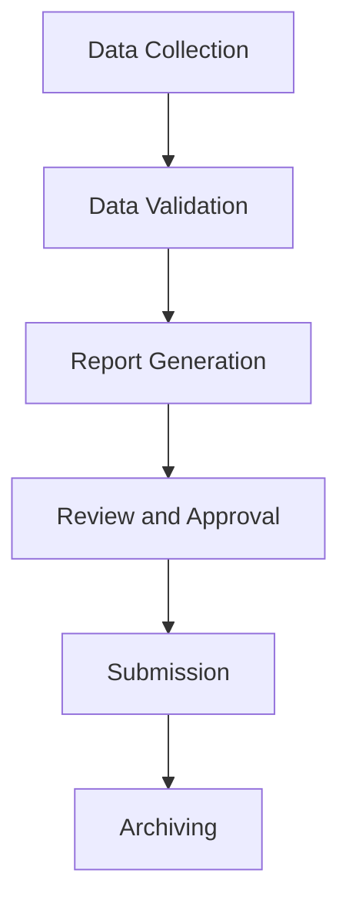

# Compliance Reporting Workflow for Water Utilities

This document outlines the plan for a compliance reporting workflow for water utilities.

## 1. Workflow Overview

The workflow will automate the process of generating and submitting compliance reports to regulatory bodies. It will handle data collection, validation, report generation, and submission.

## 2. Workflow Steps

The workflow will consist of the following steps:

- **Data Collection:** Gather water quality data from various sources.
- **Data Validation:** Validate the collected data against predefined rules and standards.
- **Report Generation:** Generate the compliance report in the required format.
- **Review and Approval:** Allow for manual review and approval of the generated report.
- **Submission:** Submit the report to the regulatory body.
- **Archiving:** Archive the submitted report for future reference.

## 3. System Architecture

## 4. Next Steps

- Define the data sources for data collection.
- Specify the data validation rules.
- Design the report template.
- Implement the workflow activities.
- Set up the review and approval process.